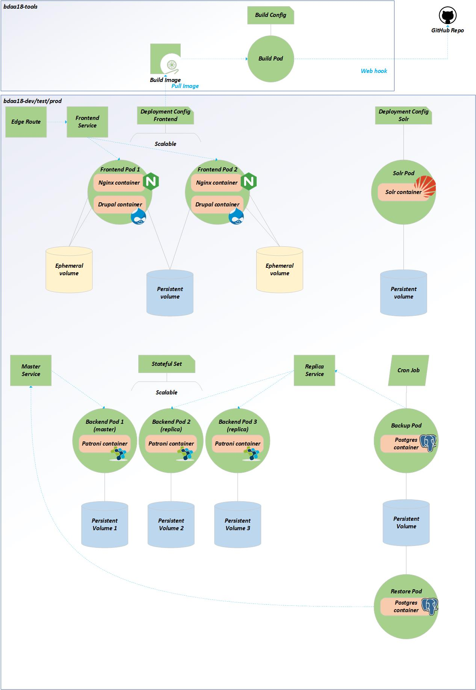

WorkBC Career Education Resources
===================================

[](https://github.com/bcgov/workbc-tr)

Career Education Resources, a subsite of [WorkBC.ca](https://www.workbc.ca).
# Initial setup
- Copy `.env.example` to `.env`
- Start the environment: `docker-compose up`
- Adjust folder permissions:
  - `mkdir src/private && docker-compose exec php sudo chown www-data /var/www/html/private`
  - `docker-compose exec php sudo chown www-data /var/www/html/config/sync`
- Import the data dump:
  - `gunzip -k -c src/scripts/workbc-tr.dump.sql.gz | docker-compose exec -T postgres psql -U drupal workbc-tr`
- Create the Solr index:
  - `docker-compose exec -u 0 solr sh -c "chown -R solr:solr /opt/solr/server/solr/workbc-tr_dev"`
  - `docker-compose exec solr sh -c "curl -sIN 'http://localhost:8983/solr/admin/cores?action=CREATE&name=workbc-tr_dev&configSet=workbc-tr&instanceDir=workbc-tr_dev'"`
  - `docker-compose exec php bash -c "drush sapi-r && drush sapi-i"`
- Edit your `hosts` file to add the following line:
```
127.0.0.1       workbc-tr.docker.localhost
```
- Run the sync script: `docker-compose exec php scripts/sync.sh`
- Open http://workbc-tr.docker.localhost:8000/ to view the site and login as `aest-local` (obtain the password from your admin or change the password using `drush upwd aest-local 'password'`)
# Architecture
The solution architecture is as below.

